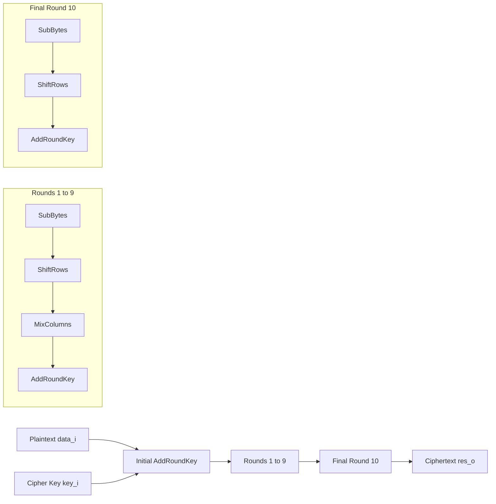
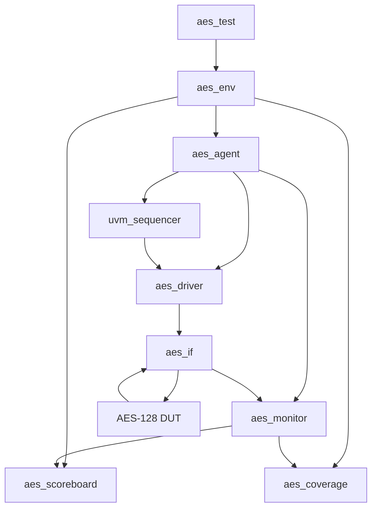

# AES-128 Encryption Core with UVM Verification

[](#)
[](#)
[](#)
[](#)

This project implements an **AES-128 encryption core** in SystemVerilog and verifies it using a compact **UVM 1.2 verification environment**. The design accepts a 128-bit plaintext block and a 128-bit cipher key, performs AES-128 encryption, and returns a 128-bit ciphertext block with an output-valid pulse.

EDA Playground link: [https://www.edaplayground.com/x/qu76](https://www.edaplayground.com/x/qu76)

---

## Table of Contents

- [Project Overview](#project-overview)
- [Repository Files](#repository-files)
- [AES-128 Basics](#aes-128-basics)
- [Design Architecture](#design-architecture)
- [DUT Interface](#dut-interface)
- [Timing and Handshake Protocol](#timing-and-handshake-protocol)
- [RTL Module Breakdown](#rtl-module-breakdown)
- [Byte Ordering](#byte-ordering)
- [Verification Architecture](#verification-architecture)
- [UVM Component Breakdown](#uvm-component-breakdown)
- [Stimulus Strategy](#stimulus-strategy)
- [Scoreboard and Reference Model](#scoreboard-and-reference-model)
- [Functional Coverage](#functional-coverage)
- [Waveform Dump and EPWave Viewing](#waveform-dump-and-epwave-viewing)
- [How to Run on EDA Playground](#how-to-run-on-eda-playground)
- [Expected Simulation Result](#expected-simulation-result)
- [Known Scope and Limitations](#known-scope-and-limitations)
- [Future Improvements](#future-improvements)

---

## Project Overview

The project contains two main SystemVerilog files:

| File | Purpose |
|---|---|
| `design.sv` | AES-128 encryption RTL design. This contains the S-box, MixColumns logic, key schedule, and top-level AES encryptor. |
| `testbench.sv` | UVM testbench. This contains the interface, transaction, sequences, driver, monitor, agent, scoreboard, coverage subscriber, environment, test, waveform dump, and simulation top. |

The implementation is designed to be easy to paste into **EDA Playground**:

- Put `design.sv` in the **Design** pane.
- Put `testbench.sv` in the **Testbench** pane.
- Select **SystemVerilog/UVM** support.
- Use **Riviera-PRO** or another UVM-capable simulator.

---

## AES-128 Basics

AES, the Advanced Encryption Standard, is a symmetric block cipher. AES-128 uses:

| Item | Value |
|---|---:|
| Block size | 128 bits |
| Key size | 128 bits |
| Number of rounds | 10 |
| Input block | Plaintext |
| Output block | Ciphertext |

At a high level, AES-128 performs:

1. Initial `AddRoundKey`
2. Rounds 1 to 9:
   - `SubBytes`
   - `ShiftRows`
   - `MixColumns`
   - `AddRoundKey`
3. Final round, Round 10:
   - `SubBytes`
   - `ShiftRows`
   - `AddRoundKey`

The final AES round **does not use `MixColumns`**. The RTL follows this rule.

---

## Design Architecture

The design encrypts one 128-bit block at a time. A new plaintext/key pair is supplied using `data_v_i`. The output ciphertext is valid only when `res_v_o` is high.


The RTL architecture can be summarized as:



---

## DUT Interface

The top-level AES module is named:

```systemverilog
module aes(
    input clk,
    input nreset,

    input          data_v_i,
    input  [127:0] data_i,
    input  [127:0] key_i,
    output         res_v_o,
    output [127:0] res_o
);
```

### Signal Description

| Signal | Direction | Width | Description |
|---|---:|---:|---|
| `clk` | Input | 1 | Main clock. |
| `nreset` | Input | 1 | Active-low reset. `0` resets the internal FSM. |
| `data_v_i` | Input | 1 | Input-valid pulse. Assert for one clock cycle with valid plaintext and key. |
| `data_i` | Input | 128 | Plaintext block. |
| `key_i` | Input | 128 | AES-128 cipher key. |
| `res_v_o` | Output | 1 | Output-valid pulse. High for one cycle when `res_o` contains valid ciphertext. |
| `res_o` | Output | 128 | Ciphertext block. Valid only when `res_v_o == 1`. |

---

## Timing and Handshake Protocol

The DUT uses a simple valid-based protocol:

1. Keep `nreset = 0` during reset.
2. Release reset by driving `nreset = 1`.
3. Drive `data_v_i = 1` for exactly one clock cycle.
4. During that same cycle, drive:
   - `data_i = plaintext`
   - `key_i = key`
5. Deassert `data_v_i`.
6. Wait until `res_v_o = 1`.
7. Sample `res_o` on the cycle where `res_v_o = 1`.


Important rule:

```systemverilog
if (res_v_o == 1'b1) begin
  // res_o contains valid ciphertext here
end
```

Do not check `res_o` when `res_v_o` is low. During internal AES rounds, `res_o` may change because it is connected to the internal state register.

---

## RTL Module Breakdown

All RTL modules are contained inside `design.sv`.

| Module | Purpose |
|---|---|
| `sbox` | Combinational AES S-box. Implements the Rijndael substitution function using a logic-network style implementation. |
| `aes_gm2` | Multiplies one byte by 2 in GF(2^8), using AES reduction polynomial logic with `8'h1b`. |
| `aes_gm3` | Multiplies one byte by 3 in GF(2^8). Implemented as `gm2(byte) ^ byte`. |
| `mixw` | Performs AES `MixColumns` on one 32-bit column/word. |
| `aes_key_first_col` | Generates the first transformed word of the next round key using `RotWord`, `SubWord`, and `Rcon`. |
| `ks` | AES-128 key schedule module. Generates the next 128-bit round key and next Rcon value. |
| `aes` | Top-level AES-128 encryption core. Contains FSM, state register, key register, SubBytes, ShiftRows, MixColumns, key schedule, and output-valid generation. |

---

## Internal AES Flow

### 1. Initial AddRoundKey

When `data_v_i` is asserted, the core loads the plaintext and key. The first state is generated by XORing the plaintext with the input key.

```systemverilog
assign round_key_next = data_v_i ? data_i : ...;
assign key_current    = data_v_i ? key_i  : key_q;
assign round_key      = round_key_next ^ key_current;
assign data_next      = round_key;
```

### 2. SubBytes

The design creates 16 parallel S-box instances, one for each byte of the 128-bit state.

```systemverilog
for (sb_i = 0; sb_i < 16; sb_i = sb_i + 1) begin
    sbox m_sbox(...);
end
```

### 3. ShiftRows

The 128-bit AES state is interpreted as a 4x4 byte matrix. The rows are rotated according to AES rules:

| Row | Operation |
|---:|---|
| Row 0 | No rotation |
| Row 1 | Rotate left by 1 byte |
| Row 2 | Rotate left by 2 bytes |
| Row 3 | Rotate left by 3 bytes |

### 4. MixColumns

For rounds 1 to 9, each 32-bit column is passed into `mixw`.

```systemverilog
for (mc_c = 0; mc_c < 4; mc_c = mc_c + 1) begin
    mixw m_mixw(...);
end
```

### 5. Final Round

The AES final round skips `MixColumns`. The RTL selects `shift_row` instead of `mix_columns` during the last iteration.

```systemverilog
assign round_key_next = data_v_i ? data_i :
                        (last_iter_v ? shift_row : mix_columns);
```

### 6. Output Valid

The output-valid signal is generated from the internal FSM.

```systemverilog
assign finished_v = fsm_q[3] & fsm_q[1] & fsm_q[0];
assign res_v_o    = finished_v;
assign res_o      = data_q;
```

---

## Byte Ordering

This project uses a specific byte mapping. This is important when comparing against software AES models or external test vectors.

```text
plaintext byte k  -> data_i[8*k +: 8]
ciphertext byte k -> res_o [8*k +: 8]
state[row][col]   -> byte index (4*col + row)
```

That means byte 0 is stored in bits `[7:0]`, byte 1 in bits `[15:8]`, and so on.

The UVM scoreboard reference model uses the same mapping as the DUT, so comparisons are bit-exact for this implementation.

---

## Verification Architecture

The verification environment is implemented in `testbench.sv` using UVM 1.2.


In the current code, the AES reference model is implemented **inside the scoreboard** rather than as a separate `AES_model` component. The diagram is still useful as a conceptual verification architecture.



---

## UVM Component Breakdown

All verification classes are contained inside `testbench.sv`.

| Component | Type | Purpose |
|---|---|---|
| `no_uvm_prints_c` | `uvm_report_catcher` | Suppresses selected UVM report display/log actions for cleaner EDA Playground output. |
| `aes_if` | SystemVerilog interface | Groups DUT pins and provides driver/monitor clocking blocks. |
| `aes_item` | `uvm_sequence_item` | Transaction object containing plaintext, key, and captured ciphertext. |
| `aes_rand_seq` | `uvm_sequence` | Generates constrained-random AES transactions. |
| `aes_corner_seq` | `uvm_sequence` | Generates directed corner-case transactions. |
| `aes_driver` | `uvm_driver` | Drives one plaintext/key pair into the DUT and waits for output completion. |
| `aes_monitor` | `uvm_monitor` | Observes input and output handshakes and publishes completed transactions. |
| `aes_agent` | `uvm_agent` | Contains sequencer, driver, and monitor. |
| `aes_coverage` | `uvm_subscriber` | Samples functional coverage from completed transactions. |
| `aes_scoreboard` | `uvm_subscriber` | Computes expected AES result and compares it with DUT output. |
| `aes_env` | `uvm_env` | Instantiates and connects agent, scoreboard, and coverage. |
| `aes_test` | `uvm_test` | Starts directed tests followed by random tests. |
| `testbench_top` | SV module | Generates clock/reset, instantiates DUT/interface, enables VCD dump, and starts UVM. |

---

## Stimulus Strategy

The testbench uses both directed and random stimulus.

### Directed Tests

The `aes_corner_seq` sequence sends important corner cases:

| Plaintext | Key | Purpose |
|---|---|---|
| All zeros | All zeros | Basic reset-like data pattern |
| All ones | All ones | Maximum switching/data stress |
| All zeros | All ones | Key-heavy corner |
| All ones | All zeros | Data-heavy corner |
| Fixed 128-bit pattern | Fixed 128-bit pattern | Repeatable non-trivial directed case |

### Random Tests

The `aes_rand_seq` sequence generates random plaintext/key pairs.

Current setting:

```systemverilog
rseq.n = 200;
```

So the default simulation runs:

```text
5 directed transactions + 200 random transactions = 205 total transactions
```

---

## Scoreboard and Reference Model

The scoreboard performs self-checking verification. It receives completed transactions from the monitor and computes the expected AES-128 ciphertext using an internal reference model.

The scoreboard implements:

| Function | Purpose |
|---|---|
| `rm_sbox()` | AES S-box lookup table. |
| `rm_xtime()` | Multiply by 2 in GF(2^8). |
| `rm_gmul()` | Generic GF(2^8) multiplication. |
| `rm_aes128()` | Full AES-128 encryption reference model. |
| `write()` | Compares DUT result against expected result. |
| `report_phase()` | Prints final pass/fail summary. |

Comparison logic:

```systemverilog
expected = rm_aes128(t.data, t.key);

if (t.result === expected)
  n_pass++;
else
  n_fail++;
```

The reference model performs:

1. State loading
2. Key expansion for 44 AES words
3. Initial AddRoundKey
4. Nine normal AES rounds
5. Final AES round without MixColumns
6. Result packing back to the DUT byte order

---

## Functional Coverage

The verification environment includes functional coverage through `aes_coverage`.

Coverage points include:

| Coverpoint | Description |
|---|---|
| `cp_data_b0` | Low byte of plaintext. |
| `cp_data_b15` | High byte of plaintext. |
| `cp_key_b0` | Low byte of key. |
| `cp_key_b15` | High byte of key. |
| `cp_data_all` | Whole-vector plaintext corner coverage: all-zero, all-one, and other. |
| `cp_key_all` | Whole-vector key corner coverage: all-zero, all-one, and other. |
| `x_db0_kb0` | Cross coverage between plaintext byte 0 and key byte 0. |

The byte coverpoints use low, mid, high, zero, and all-ones bins where applicable.

---

## Waveform Dump and EPWave Viewing

The testbench creates a VCD file for EPWave:

```systemverilog
initial begin
  $dumpfile("dump.vcd");

  $dumpvars(0, testbench_top.clk);
  $dumpvars(0, testbench_top.vif.nreset);

  $dumpvars(0, testbench_top.vif.data_v_i);
  $dumpvars(0, testbench_top.vif.data_i);
  $dumpvars(0, testbench_top.vif.key_i);

  $dumpvars(0, testbench_top.vif.res_v_o);
  $dumpvars(0, testbench_top.vif.res_o);
end
```

Recommended EPWave signals:

| Signal | Radix |
|---|---|
| `clk` | Binary |
| `nreset` | Binary |
| `data_v_i` | Binary |
| `data_i[127:0]` | Hexadecimal |
| `key_i[127:0]` | Hexadecimal |
| `res_v_o` | Binary |
| `res_o[127:0]` | Hexadecimal |

When checking waveforms, sample `res_o` only on the clock cycle where `res_v_o` is high.

---

## How to Run on EDA Playground

### 1. Open the project

Use the provided EDA Playground project:

[Open AES-128 UVM project on EDA Playground](https://www.edaplayground.com/x/qu76)

### 2. Tool Setup

Recommended setup:

| Setting | Value |
|---|---|
| Language | SystemVerilog |
| Methodology | UVM 1.2 |
| Simulator | Aldec Riviera-PRO |
| Design file | `design.sv` |
| Testbench file | `testbench.sv` |

### 3. Compile Command

The EDA Playground compile command should include the UVM library and both source files.

Example:

```bash
vlib work && \
vlog -timescale 1ns/1ns \
  +incdir+$RIVIERA_HOME/vlib/uvm-1.2/src \
  -l uvm_1_2 \
  design.sv testbench.sv
```

### 4. Run Command

Use the actual registered UVM test name:

```bash
vsim -c -do "vsim +access+r +UVM_TESTNAME=aes_test +UVM_VERBOSITY=UVM_MEDIUM +UVM_NO_RELNOTES; run -all; exit"
```

Important:

```text
Correct test name: aes_test
Do not use: aes_top
```

`aes_top` is not a registered UVM test class in this testbench. The DUT module is named `aes`, and the UVM test class is named `aes_test`.

---

## Expected Simulation Result

The expected result is:

```text
SCOREBOARD: ALL 205 TRANSACTIONS PASSED
```

The exact printed log may be minimal because `no_uvm_prints_c` suppresses selected UVM report display/log actions. If you want to see all UVM messages, remove or comment out this block in `testbench_top`:

```systemverilog
no_uvm_prints = new("no_uvm_prints");
uvm_report_cb::add(null, no_uvm_prints);
```

You can also remove the `no_uvm_prints_c` class if full UVM logging is preferred.

---

## Important Notes for Beginners

### Plaintext vs Ciphertext

- `data_i` is the plaintext input.
- `key_i` is the AES-128 key.
- `res_o` is the ciphertext output.

### Valid Signals

- `data_v_i` tells the DUT that the input is valid.
- `res_v_o` tells the testbench that the output is valid.

### Why `res_o` changes before `res_v_o`

Internally, AES updates the state across multiple rounds. Since `res_o` is assigned to the internal state register, it may change before the final ciphertext is ready. This is normal. Only trust the output when `res_v_o` is high.

### Why the driver waits for `res_v_o`

This AES core processes one block at a time. The current UVM driver waits for the result before sending the next transaction. This avoids overlapping transactions and keeps the protocol simple.

---

## Known Scope and Limitations

This project currently supports:

- AES-128 encryption
- 128-bit plaintext block input
- 128-bit key input
- One-block-at-a-time operation
- UVM self-checking verification
- Functional coverage
- VCD waveform viewing through EPWave

This project does not currently implement:

- AES decryption
- AES-192 or AES-256
- Streaming back-to-back pipelined input
- AXI/APB/AHB wrapper
- Synthesis constraints
- Formal verification
- Side-channel countermeasures
- Masking or fault-injection protection

---

## Future Improvements

Possible extensions:

1. Add AES decryption support.
2. Add AES-192 and AES-256 key sizes.
3. Add ready/valid handshaking.
4. Add a fully pipelined AES implementation.
5. Add NIST known-answer test vectors as directed tests.
6. Add assertions for protocol checking.
7. Add coverage for all 16 plaintext/key bytes.
8. Add a register bus wrapper such as APB or AXI-Lite.
9. Add synthesis reports for FPGA or ASIC flow.
10. Add CI regression using open-source simulators where supported.

---

## Image Notes

The included images are useful, but with the following accuracy notes:

| Image | Recommendation |
|---|---|
| `image-1.png` | Use. It explains the input/output timing behavior. |
| `image-2.png` | Use. It correctly shows rounds 1 to 9 with `MixColumns` and the final round without `MixColumns`. |
| `image-3.png` | Use only after correction. If it shows `MixColumns` inside Round 10, it does not match AES-128 or this RTL. |
| `image-4.png` | Use as a conceptual UVM diagram. In the current code, the AES reference model is implemented inside `aes_scoreboard`, not as a separate class. |

---

## License

Add your preferred open-source license here, for example:

```text
MIT License
Apache-2.0
BSD-3-Clause
```

If this project is based on third-party AES RTL, include the original license and attribution before publishing publicly.
