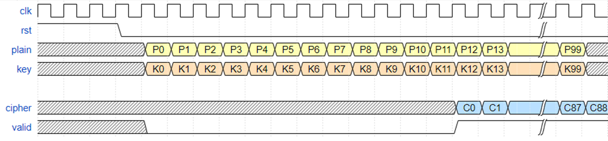
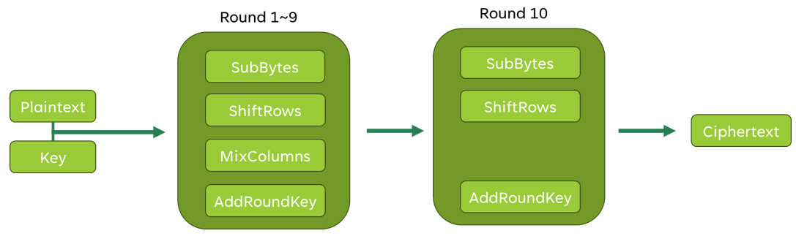
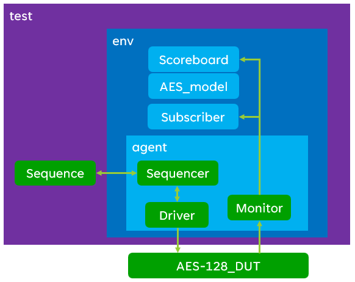

# AES-128 Encryption Core with UVM Verification

[](#)
[](#)
[](#)
[](https://www.edaplayground.com/x/qu76)
[](#functional-coverage-results)
[](#latest-verified-result)

A compact open-source-style **AES-128 encryption RTL core** with a complete **SystemVerilog UVM verification environment**. The design accepts a 128-bit plaintext block and a 128-bit AES key, performs AES-128 encryption, and returns a 128-bit ciphertext block with an output-valid pulse.

The verification environment includes an active UVM agent, constrained-random and directed stimulus, monitor, scoreboard with an internal bit-exact AES-128 reference model, functional coverage, coverage closure reporting, and EPWave waveform support.

**EDA Playground:** <https://www.edaplayground.com/x/qu76>

---

## Table of Contents

- [Project Highlights](#project-highlights)
- [Repository Structure](#repository-structure)
- [Quick Start on EDA Playground](#quick-start-on-eda-playground)
- [Latest Verified Result](#latest-verified-result)
- [AES-128 Basics](#aes-128-basics)
- [RTL Design Overview](#rtl-design-overview)
- [DUT Interface](#dut-interface)
- [Handshake and Timing Protocol](#handshake-and-timing-protocol)
- [RTL Module Breakdown](#rtl-module-breakdown)
- [Internal AES Data Flow](#internal-aes-data-flow)
- [Byte Ordering](#byte-ordering)
- [UVM Verification Architecture](#uvm-verification-architecture)
- [UVM Component Breakdown](#uvm-component-breakdown)
- [Stimulus Strategy](#stimulus-strategy)
- [Scoreboard and AES Reference Model](#scoreboard-and-aes-reference-model)
- [Functional Coverage Model](#functional-coverage-model)
- [Functional Coverage Results](#functional-coverage-results)
- [Waveform Dump and EPWave Debug](#waveform-dump-and-epwave-debug)
- [Expected Console Output](#expected-console-output)
- [Image and Diagram Notes](#image-and-diagram-notes)
- [Known Scope and Limitations](#known-scope-and-limitations)
- [Future Improvements](#future-improvements)
- [Source Attribution and License](#source-attribution-and-license)

---

## Project Highlights

This project satisfies the following verification objective:

> **AES-128 Cryptographic Block** — Build a complete UVM environment in SystemVerilog for an AES-128 RTL core on EDA Playground, targeting constrained-random stimulus generation, functional coverage collection, cryptographic accelerator verification, coverage-driven methodology, and UVM architecture.

Implemented features:

- AES-128 encryption RTL core.
- 128-bit plaintext input.
- 128-bit key input.
- 128-bit ciphertext output.
- Valid-based input/output protocol.
- UVM 1.2 testbench.
- Active UVM agent.
- Sequencer, driver, and monitor.
- Scoreboard with internal AES-128 reference model.
- Directed corner-case sequence.
- Directed coverage-closure sequence.
- Constrained-random sequence.
- Functional coverage with byte-level and transaction-level covergroups.
- 90% functional coverage target.
- Latest run achieved **99.82% total functional coverage**.
- EPWave/VCD waveform debug support.
- Self-contained EDA Playground setup.

---

## Repository Structure

For EDA Playground, the project is intentionally kept in two main files:

```text
.
├── design.sv       # AES-128 RTL core
├── testbench.sv    # UVM verification environment
├── README.md       # Project documentation
└── picture/        # Optional diagrams used by README
    ├── image-1.png # Timing diagram
    ├── image-2.png # AES round architecture
    ├── image-3.png # Optional round-flow diagram; check final-round accuracy
    └── image-4.png # UVM verification architecture
```

In EDA Playground:

| EDA Playground Pane | File |
|---|---|
| Design pane | `design.sv` |
| Testbench pane | `testbench.sv` |

---

## Quick Start on EDA Playground

Open:

```text
https://www.edaplayground.com/x/qu76
```

Recommended setup:

| Setting | Value |
|---|---|
| Language | SystemVerilog |
| Methodology | UVM 1.2 |
| Simulator | Aldec Riviera-PRO |
| Top-level simulation module | `testbench_top` |
| UVM test name | `aes_test` |

Use this run command:

```bash
vlib work && vlog '-timescale' '1ns/1ns' \
  +incdir+$RIVIERA_HOME/vlib/uvm-1.2/src \
  -l uvm_1_2 \
  -err VCP2947 W9 \
  -err VCP2974 W9 \
  -err VCP3003 W9 \
  -err VCP5417 W9 \
  -err VCP6120 W9 \
  -err VCP7862 W9 \
  -err VCP2129 W9 \
  design.sv testbench.sv && \
vsim -c -do "vsim +access+r +UVM_TESTNAME=aes_test +UVM_VERBOSITY=UVM_MEDIUM +UVM_NO_RELNOTES; run -all; exit"
```

Important:

```text
Correct UVM test name : aes_test
Do not use            : aes_top
```

`aes_top` is not a UVM test class. The DUT module is named `aes`; the registered UVM test class is named `aes_test`.

---

## Latest Verified Result

Latest verified simulation result:

```text
Compile result     : 0 errors, 0 warnings
UVM test           : aes_test
Directed sequence  : completed
Random sequence    : 500 constrained-random transactions
Total transactions : 561
Scoreboard result  : ALL 561 TRANSACTIONS PASSED
UVM warnings       : 0
UVM errors         : 0
UVM fatals         : 0
Byte coverage      : 99.64%
Transaction cov.   : 100.00%
Total coverage     : 99.82%
Coverage target    : 90.00%
VCD file           : dump.vcd
Coverage database  : fcover.acdb
```

This confirms that the project is self-checking, functionally verified, and coverage-closed above the target.

---

## AES-128 Basics

AES, the Advanced Encryption Standard, is a symmetric block cipher. AES-128 encrypts one 128-bit block using one 128-bit key.

| Property | Value |
|---|---:|
| Plaintext block size | 128 bits |
| Ciphertext block size | 128 bits |
| Key size | 128 bits |
| Number of AES rounds | 10 |
| Operation implemented | Encryption only |

AES-128 encryption consists of:

1. Initial `AddRoundKey`
2. Rounds 1 to 9:
   - `SubBytes`
   - `ShiftRows`
   - `MixColumns`
   - `AddRoundKey`
3. Final Round 10:
   - `SubBytes`
   - `ShiftRows`
   - `AddRoundKey`

The final AES round **does not include `MixColumns`**. The RTL implements this correctly.

---

## RTL Design Overview

The RTL is contained in `design.sv`.

Top-level RTL module:

```systemverilog
module aes(
    input clk,
    input nreset,

    input          data_v_i,
    input  [127:0] data_i,
    input  [127:0] key_i,
    output         res_v_o,
    output [127:0] res_o
);
```

High-level behavior:

1. `data_v_i` is pulsed high for one clock cycle.
2. During that pulse, `data_i` and `key_i` are sampled.
3. The AES core performs iterative AES-128 encryption.
4. When encryption is complete, `res_v_o` pulses high.
5. `res_o` contains the valid ciphertext only when `res_v_o == 1`.

The design is an iterative one-block-at-a-time AES encryptor. It is not a streaming or fully pipelined AES implementation.

---

## DUT Interface

| Signal | Direction | Width | Description |
|---|---:|---:|---|
| `clk` | Input | 1 | Main clock. |
| `nreset` | Input | 1 | Active-low reset. Drive `0` to reset the AES core. |
| `data_v_i` | Input | 1 | Input-valid pulse. Assert for one cycle with valid plaintext/key. |
| `data_i` | Input | 128 | Plaintext block. |
| `key_i` | Input | 128 | AES-128 encryption key. |
| `res_v_o` | Output | 1 | Output-valid pulse. High for one cycle when ciphertext is valid. |
| `res_o` | Output | 128 | Ciphertext output. Only valid when `res_v_o` is high. |

---

## Handshake and Timing Protocol

The DUT uses a simple valid-only input/output protocol.

### Input transfer

The testbench drives:

```systemverilog
data_v_i = 1'b1;
data_i   = plaintext;
key_i    = key;
```

for one clock cycle.

### Output transfer

The testbench waits until:

```systemverilog
res_v_o == 1'b1
```

Then it samples:

```systemverilog
res_o
```

### Important waveform rule

`res_o` is connected to the internal AES state register, so it may toggle during intermediate AES rounds. This is normal. Only check the ciphertext when:

```systemverilog
res_v_o == 1'b1
```

---

## RTL Module Breakdown

All RTL modules are implemented inside `design.sv`.

| Module | Purpose |
|---|---|
| `sbox` | Combinational AES S-box. Implements the byte substitution stage used by `SubBytes` and key expansion. |
| `aes_gm2` | Multiplies an AES byte by 2 in GF(2^8). Uses AES polynomial reduction with `8'h1b`. |
| `aes_gm3` | Multiplies an AES byte by 3 in GF(2^8). Implemented as `gm2(byte) ^ byte`. |
| `mixw` | Applies AES `MixColumns` to one 32-bit column of the state. |
| `aes_key_first_col` | Implements the transformed first word of the AES key schedule using `RotWord`, `SubWord`, and `Rcon`. |
| `ks` | AES-128 key schedule. Produces the next 128-bit round key and next Rcon value. |
| `aes` | Top-level AES-128 encryption core with FSM, state register, key register, round transformation logic, and output-valid generation. |

---

## Internal AES Data Flow

### 1. State and FSM

The top-level AES module contains:

- `data_q` — internal 128-bit AES state register.
- `key_q` — current 128-bit round key register.
- `key_rcon_q` — current Rcon value.
- `fsm_q` — 4-bit round/control counter.

The internal FSM starts when `data_v_i` is asserted and advances through the AES rounds. The output-valid pulse is generated from the FSM terminal state.

### 2. Initial AddRoundKey

When a new input transaction arrives, the plaintext is XORed with the input key:

```systemverilog
round_key_next = data_v_i ? data_i : ...;
key_current    = data_v_i ? key_i  : key_q;
round_key      = round_key_next ^ key_current;
data_next      = round_key;
```

### 3. SubBytes

The RTL instantiates 16 parallel S-boxes:

```systemverilog
for (sb_i = 0; sb_i < 16; sb_i = sb_i + 1) begin
  sbox m_sbox(...);
end
```

Each byte of the 128-bit state is substituted independently.

### 4. ShiftRows

The 128-bit state is treated as a 4x4 byte matrix. Rows are cyclically shifted according to AES rules:

| Row | AES operation |
|---:|---|
| Row 0 | No shift |
| Row 1 | Rotate left by 1 byte |
| Row 2 | Rotate left by 2 bytes |
| Row 3 | Rotate left by 3 bytes |

### 5. MixColumns

For normal rounds, each 32-bit state column goes through `mixw`.

`mixw` uses AES finite-field multiplication by 2 and 3:

```text
mb0 = 2*b0 ^ 3*b1 ^ b2   ^ b3
mb1 = b0   ^ 2*b1 ^ 3*b2 ^ b3
mb2 = b0   ^ b1   ^ 2*b2 ^ 3*b3
mb3 = 3*b0 ^ b1   ^ b2   ^ 2*b3
```

### 6. Key Schedule

The `ks` module generates the next AES round key from the current key.

It uses:

- Word splitting into four 32-bit columns.
- `RotWord`
- `SubWord`
- Rcon update.
- AES XOR expansion chain.

### 7. Final Round

The final round skips `MixColumns`:

```systemverilog
round_key_next = data_v_i ? data_i :
                 (last_iter_v ? shift_row : mix_columns);
```

When `last_iter_v` is true, `shift_row` is used directly before `AddRoundKey`.

### 8. Result Output

The design exports:

```systemverilog
assign res_v_o = finished_v;
assign res_o   = data_q;
```

`res_o` should be sampled only on the cycle where `res_v_o` is high.

---

## Byte Ordering

This project uses the following byte mapping:

```text
plaintext byte k  -> data_i[8*k +: 8]
ciphertext byte k -> res_o [8*k +: 8]
state[row][col]   -> byte index (4*col + row)
```

Byte 0 is stored in bits `[7:0]`, byte 1 in bits `[15:8]`, and byte 15 in bits `[127:120]`.

The scoreboard reference model uses the same byte ordering as the DUT, so DUT/reference comparisons are bit-exact.

When comparing with external AES tools or NIST-style test vectors, byte-order conversion may be required.

---

## UVM Verification Architecture

The verification environment is implemented in `testbench.sv`.

```mermaid
flowchart TB
    TEST[aes_test] --> ENV[aes_env]

    ENV --> AGENT[aes_agent]
    ENV --> SB[aes_scoreboard]
    ENV --> COV[aes_coverage]

    AGENT --> SEQR[uvm_sequencer#(aes_item)]
    AGENT --> DRV[aes_driver]
    AGENT --> MON[aes_monitor]

    SEQR --> DRV
    DRV --> IF[aes_if]
    IF --> DUT[aes DUT]
    DUT --> IF
    IF --> MON

    MON -- completed aes_item --> SB
    MON -- completed aes_item --> COV

    SB --> RM[Internal AES-128 reference model]
```

The design follows the standard UVM structure:

```text
test -> env -> agent -> sequencer/driver/monitor
              -> scoreboard
              -> coverage subscriber
```

---

## UVM Component Breakdown

| Component | Type | Purpose |
|---|---|---|
| `aes_if` | Interface | Groups DUT pins and provides driver/monitor clocking blocks. |
| `aes_pattern_e` | Enum | Defines transaction pattern categories for constrained-random and coverage closure. |
| `aes_item` | `uvm_sequence_item` | Transaction object containing plaintext, key, captured result, latency, and random pattern selectors. |
| `aes_rand_seq` | `uvm_sequence #(aes_item)` | Generates constrained-random AES transactions using weighted pattern distributions. |
| `aes_corner_seq` | `uvm_sequence #(aes_item)` | Generates directed corner cases and a deterministic 7x7 coverage-closure sweep. |
| `aes_driver` | `uvm_driver #(aes_item)` | Drives one plaintext/key transaction into the DUT and waits for completion. |
| `aes_monitor` | `uvm_monitor` | Captures input data/key, waits for `res_v_o`, captures ciphertext, measures latency, and broadcasts completed transactions. |
| `aes_agent` | `uvm_agent` | Instantiates the sequencer, driver, and monitor. |
| `aes_coverage` | `uvm_subscriber #(aes_item)` | Samples byte-level and transaction-level functional coverage. |
| `aes_scoreboard` | `uvm_subscriber #(aes_item)` | Computes expected AES-128 ciphertext and compares it with DUT output. |
| `aes_env` | `uvm_env` | Instantiates and connects the agent, scoreboard, and coverage subscriber. |
| `aes_test` | `uvm_test` | Runs directed coverage-closure sequence followed by constrained-random stimulus. |
| `testbench_top` | Module | Generates clock/reset, instantiates DUT/interface, enables VCD dump, configures UVM, and starts `aes_test`. |

---

## Stimulus Strategy

The testbench uses a combined directed and constrained-random strategy.

### Transaction pattern enum

```systemverilog
typedef enum int unsigned {
  AES_PATTERN_RANDOM,
  AES_PATTERN_ALL_ZERO,
  AES_PATTERN_ALL_ONE,
  AES_PATTERN_SAME_BYTE,
  AES_PATTERN_ALT_A5,
  AES_PATTERN_ALT_5A,
  AES_PATTERN_BYTE_RAMP,
  AES_PATTERN_WALKING_ONE,
  AES_PATTERN_WALKING_ZERO
} aes_pattern_e;
```

### Directed sequence

`aes_corner_seq` performs two jobs:

1. Sends meaningful AES corner cases.
2. Performs deterministic coverage closure for the plaintext/key class cross.

Directed cases include:

| Plaintext type | Key type | Purpose |
|---|---|---|
| All zero | All zero | Basic low-activity corner |
| All one | All one | Maximum-value corner |
| All zero | All one | Key-dominant corner |
| All one | All zero | Data-dominant corner |
| Same-byte vector | Same-byte vector | Repeated-byte structure |
| Alternating A5 | Alternating 5A | Alternating-bit stress |
| Alternating 5A | Alternating A5 | Complementary alternating stress |
| Walking one | Walking zero | Single-bit sensitivity |
| Walking zero | Walking one | Complement single-bit sensitivity |
| Byte ramp | Byte ramp | Ordered byte pattern |
| FIPS-style plaintext/key | Ramp key | External-vector-style ordering |
| ASCII-style pattern | ASCII-style pattern | Non-trivial human-readable pattern |

The sequence also performs a deterministic:

```text
7 plaintext classes x 7 key classes = 49 cross-coverage transactions
```

This ensures transaction-level coverage closure without relying only on random chance.

### Constrained-random sequence

`aes_rand_seq` generates randomized `aes_item` transactions. The current test sets:

```systemverilog
rseq.n = 500;
```

The random distribution is weighted:

| Pattern | Weight |
|---|---:|
| Random | 60 |
| All zero | 4 |
| All one | 4 |
| Same byte | 6 |
| Alternating A5 | 4 |
| Alternating 5A | 4 |
| Byte ramp | 6 |
| Walking one | 6 |
| Walking zero | 6 |

This balances broad random exploration with targeted coverage hits.

### Total transaction count

Current run:

```text
61 directed transactions + 500 constrained-random transactions = 561 total transactions
```

---

## Scoreboard and AES Reference Model

The scoreboard is self-checking. It receives completed transactions from the monitor and computes the expected AES-128 ciphertext using an internal reference model.

Scoreboard functions:

| Function | Purpose |
|---|---|
| `rm_sbox()` | AES S-box lookup table. |
| `rm_xtime()` | GF(2^8) multiply-by-2 helper. |
| `rm_gmul()` | Generic GF(2^8) multiplier. |
| `rm_aes128()` | Full AES-128 encryption reference model. |
| `write()` | Compares DUT output against expected reference output. |
| `report_phase()` | Prints final pass/fail summary. |

The scoreboard flow is:

```text
monitor transaction
        |
        v
scoreboard rm_aes128(data, key)
        |
        v
expected ciphertext
        |
        v
compare expected vs DUT res_o
```

Pass/fail logic:

```systemverilog
expected = rm_aes128(t.data, t.key);

if (t.result === expected)
  n_pass++;
else
  n_fail++;
```

A passing run prints:

```text
SCOREBOARD: ALL 561 TRANSACTIONS PASSED
```

---

## Functional Coverage Model

Functional coverage is implemented in `aes_coverage`.

The coverage model has two covergroups:

1. `cg_byte`
2. `cg_txn`

### Byte-level coverage: `cg_byte`

`cg_byte` samples all 16 byte positions of:

- plaintext
- key
- ciphertext

For each byte, the following value bins are covered:

| Bin | Range |
|---|---|
| `zero` | `8'h00` |
| `ones` | `8'hff` |
| `low` | `8'h01` to `8'h3f` |
| `mid` | `8'h40` to `8'hbf` |
| `high` | `8'hc0` to `8'hfe` |

Cross coverage is collected for:

```text
byte_index x plaintext_byte_class
byte_index x key_byte_class
byte_index x ciphertext_byte_class
```

### Transaction-level coverage: `cg_txn`

Transaction-level coverage classifies complete 128-bit plaintext/key vectors into:

| Class ID | Class |
|---:|---|
| 0 | All zero |
| 1 | All one |
| 2 | Same byte |
| 3 | Walking one |
| 4 | Walking zero |
| 5 | Alternating A5/5A |
| 6 | Mixed/random |

Transaction coverage includes:

- Plaintext vector class.
- Key vector class.
- Plaintext/key vector-class cross.
- Legal AES iterative latency.
- Non-zero ciphertext.
- Ciphertext changed from plaintext.

### Latency coverage

The monitor measures the number of cycles from accepted input-valid to output-valid. The coverage model treats the expected iterative latency window as:

```systemverilog
bins legal_iterative_latency = {[8:20]};
```

Shorter or longer latency values are excluded from coverage scoring using explicit ignore bins for Riviera-PRO compatibility.

### Coverage target

The target is:

```text
Total functional coverage >= 90%
```

The coverage class prints:

```text
COVERAGE SUMMARY: byte_cov=<value>% txn_cov=<value>% total_cov=<value>% target=90.00%
```

If the target is reached, it prints:

```text
Coverage target reached
```

---

## Functional Coverage Results

Latest successful run:

```text
COVERAGE SUMMARY: byte_cov=99.64% txn_cov=100.00% total_cov=99.82% target=90.00%
Coverage target reached
```

Coverage summary:

| Coverage metric | Result |
|---|---:|
| Byte coverage | 99.64% |
| Transaction coverage | 100.00% |
| Total functional coverage | 99.82% |
| Coverage target | 90.00% |
| Target status | Reached |

The simulator also saves functional coverage data:

```text
fcover.acdb
```

---

## Waveform Dump and EPWave Debug

The testbench generates a VCD file:

```systemverilog
initial begin
  $dumpfile("dump.vcd");

  $dumpvars(0, testbench_top.clk);
  $dumpvars(0, testbench_top.vif.nreset);

  $dumpvars(0, testbench_top.vif.data_v_i);
  $dumpvars(0, testbench_top.vif.data_i);
  $dumpvars(0, testbench_top.vif.key_i);

  $dumpvars(0, testbench_top.vif.res_v_o);
  $dumpvars(0, testbench_top.vif.res_o);
end
```

EDA Playground opens EPWave automatically when `dump.vcd` is found.

Recommended waveform signals:

| Signal | Radix | Meaning |
|---|---|---|
| `clk` | Binary | Clock |
| `nreset` | Binary | Active-low reset |
| `data_v_i` | Binary | Input transaction valid |
| `data_i[127:0]` | Hexadecimal | Plaintext |
| `key_i[127:0]` | Hexadecimal | AES key |
| `res_v_o` | Binary | Output ciphertext valid |
| `res_o[127:0]` | Hexadecimal | Ciphertext |

Waveform interpretation:

- `data_v_i` pulses high when plaintext/key are driven.
- `res_v_o` pulses high when the ciphertext is ready.
- `res_o` may toggle before `res_v_o`; this is internal AES state activity.
- Only capture `res_o` when `res_v_o` is high.

---

## Expected Console Output

A successful run should include:

```text
SUCCESS "Compile success 0 Errors 0 Warnings"
UVM_INFO ... Running test aes_test...
UVM_INFO ... AES UVM test started
UVM_INFO ... Starting directed AES corner and coverage-closure sequence
UVM_INFO ... Starting constrained-random AES sequence with 500 transactions
UVM_INFO ... AES UVM test completed
UVM_INFO ... COVERAGE SUMMARY: byte_cov=99.64% txn_cov=100.00% total_cov=99.82% target=90.00%
UVM_INFO ... Coverage target reached
UVM_INFO ... SCOREBOARD: ALL 561 TRANSACTIONS PASSED
```

The UVM report summary should show:

```text
UVM_WARNING : 0
UVM_ERROR   : 0
UVM_FATAL   : 0
```

---

## Image and Diagram Notes

The following diagrams are useful for the README if they are stored under `picture/`:

| Image | Use? | Notes |
|---|---:|---|
| `picture/image-1.png` | Yes | Timing diagram showing input plaintext/key stream and delayed ciphertext/valid output. |
| `picture/image-2.png` | Yes | AES architecture showing rounds 1-9 and final round without `MixColumns`. |
| `picture/image-3.png` | Conditional | Use only if Round 10 does **not** show `MixColumns`. AES final round must skip `MixColumns`. |
| `picture/image-4.png` | Yes | UVM architecture diagram. In this code, the AES reference model is inside `aes_scoreboard`. |

Markdown image examples:

```markdown





```

---

## Known Scope and Limitations

Implemented:

- AES-128 encryption.
- One 128-bit block per transaction.
- One-cycle input valid.
- One-cycle output valid.
- UVM agent/driver/monitor/scoreboard architecture.
- Directed testing.
- Constrained-random testing.
- Functional coverage.
- Coverage target and closure reporting.
- EPWave waveform debug.

Not implemented:

- AES decryption.
- AES-192 or AES-256.
- Streaming ready/valid backpressure.
- Fully pipelined AES throughput.
- AXI, APB, AHB, or Wishbone wrapper.
- Register model / UVM RAL.
- Assertions for protocol checking.
- Formal verification.
- Fault injection.
- Masking or side-channel resistance.
- Synthesis/timing/power reports.

---

## Future Improvements

Suggested improvements:

1. Add NIST known-answer vectors as named directed tests.
2. Add SystemVerilog assertions for protocol checks:
   - `data_v_i` one-cycle pulse
   - input stability during valid
   - bounded output latency
   - `res_v_o` one-cycle pulse
3. Add AES decryption support.
4. Add AES-192 and AES-256 modes.
5. Add ready/valid or streaming interface.
6. Add APB or AXI-Lite register wrapper.
7. Add UVM RAL model if a register interface is added.
8. Add regression scripts and seed control.
9. Add GitHub Actions or CI flow with an available simulator.
10. Add synthesis reports for FPGA or ASIC flows.
11. Add more waveform screenshots to document input/output protocol.
12. Add external Python/C reference comparison for cross-tool validation.

---

## Source Attribution and License

The `design.sv` header contains attribution placeholders:

```text
Original source     : <ADD_ORIGINAL_AES_RTL_REPOSITORY_URL_HERE>
Original author(s)  : <ADD_AUTHOR_NAME_OR_PROJECT_NAME_HERE>
Original license    : <ADD_LICENSE_NAME_HERE>
Local modifications : Concatenated into one EDA Playground file and used
                      with the UVM verification environment.
```

Before publishing publicly:

1. If the AES RTL is your own work, state that clearly.
2. If the AES RTL was copied or adapted from an open-source project, keep the original author, repository URL, and license.
3. Add a license file such as:
   - MIT
   - Apache-2.0
   - BSD-3-Clause
4. Do not remove upstream attribution.

Suggested README wording if the RTL is adapted:

```text
The AES RTL core is adapted from <project/repository>, originally authored by <author>.
Local modifications were made to package the design into a single EDA Playground-compatible file
and connect it to the UVM verification environment.
```

---

## Final Project Summary

This project demonstrates a complete UVM verification flow for an AES-128 cryptographic accelerator. It includes a real RTL DUT, self-checking scoreboard, bit-exact AES reference model, constrained-random generation, deterministic coverage closure, functional coverage reporting, and waveform debug. The latest run verifies **561 AES transactions** with **zero mismatches**, **zero UVM errors/fatals**, and **99.82% total functional coverage** against a **90% coverage target**.

